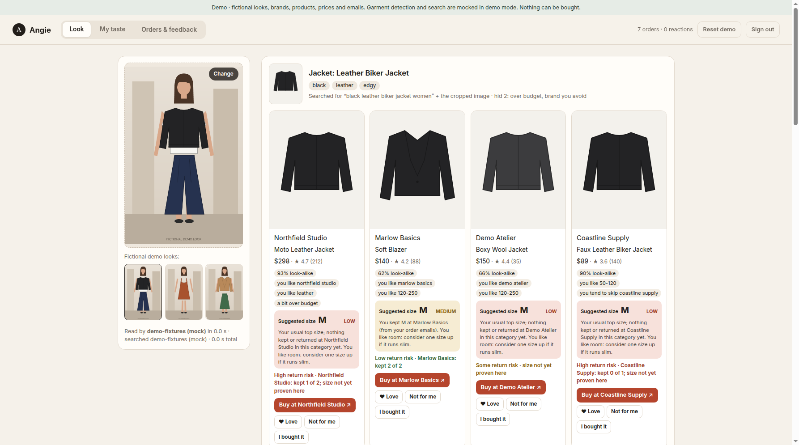

# Angie

[](https://github.com/jonathanangel-1/angie-public/actions/workflows/public-checks.yml)

Upload a photo of a look. Angie picks out each garment, finds similar items you can buy on the web right now, and ranks them by what you're likely to keep. Each result comes with a buy link, price, suggested size and a return-risk note. There is no catalog to maintain.

Why it works this way, and what was measured: **[docs/DECISION-v3.md](docs/DECISION-v3.md)**.



## How it works

1. **Garments.** An open-weight model pipeline (`spike/`) finds the main person, segments each garment, splits a jacket from the top under it, and describes each piece. It runs on CPU and needs no key.
2. **Where to look.** Each piece is searched live by its cropped image and by an attribute query:
   - **Shopify Global Catalog**, Shopify's official cross-merchant agent endpoint. Keyless.
   - **Google Lens + Google Shopping via SerpApi**, only if `SERPAPI_API_KEY` is set.
3. **Ranking** (`lib/taste/`):
   - look-alike score, learned taste, return risk and budget;
   - hard "never wear" and "brands I avoid" filters;
   - suggested size from what you kept or returned at that brand, else your usual size.

## Try the demo (fictional data, no keys, no Python)

Requires Node.js 24 (22.9+ works).

```sh
npm ci --ignore-scripts
npm run demo            # http://127.0.0.1:4175, code: demo-participant
```

1. **My taste:** the day-one quiz is pre-filled for the fictional demo person. Try **Load 7 fictional sample emails**, review the parsed orders and returns, then **Import**.
2. **Look:** pick a fictional look. You'll see its pieces, and for each piece a set of matches with buy links, suggested size and return risk. After the import, the Northfield trouser suggestion moves from 8 to 10, because of a "too small" return found in the emails.
3. Give feedback: **♥ Love**, **Not for me** (and why), **I bought it**, then **Kept it** or **Returned it** (and why). The look re-ranks immediately.

In demo mode, garment detection and product search are **mocked** with fictional fixtures. Everything else (ranking, taste, sizing, email parsing, storage) is the real code.

## Use it for real (private, local)

```sh
# 1. The garment service (Python 3.10+, CPU only, ~3 GB RAM, models download once from Hugging Face)
python3 -m venv .venv && . .venv/bin/activate
pip install --index-url https://download.pytorch.org/whl/cpu torch torchvision
pip install -r spike/requirements.txt
python spike/server.py                   # http://127.0.0.1:8765

# 2. The app
cp .env.example .env.local               # set ANGIE_ACCESS_CODE
npm run dev                              # http://127.0.0.1:3000
```

Your quiz answers, orders and reactions stay in the local database under `.wrangler/`, which is gitignored. Photos are processed in memory and never stored. Search results are never cached, as Shopify's catalog terms require. **Never commit real photos, orders or emails.** Keep any personal files in `private/`, which is also gitignored.

### Keys

| Variable | Needed? | What |
| --- | --- | --- |
| `ANGIE_ACCESS_CODE` | yes (private mode) | Your sign-in code. |
| `GARMENT_SERVICE_URL` | yes (private mode) | Where `spike/server.py` runs. |
| `SERPAPI_API_KEY` | optional, paid | Adds Google Lens + Shopping for stores not on Shopify. The free plan has 250 searches/month (~60 looks). Google Lens also needs crop hosting, which is not built yet, so only Google Shopping runs. |
| `EXTRA_ACCESS_CODES` | optional | More people: `userId:code,…`. |

Nothing is purchased or signed up for by this project.

## The spike (real public photos)

```sh
python spike/run_spike.py /tmp/spike-out   # writes spike_0N_*.png and spike_results.json
```

It downloads the five photos listed in [`spike/photos.json`](spike/photos.json) (Wikimedia Commons, CC0 / CC BY 2.0, with source and author). It then runs the full pipeline against the live Shopify catalog and records timings and every API call. The photos are not committed.

## Tests

```sh
npm test                 # taste model, sizing, return risk, email parsing, source parsers
npx --no-install tsc --noEmit && npm run lint && npm run build
npm run test:e2e         # real routes + local D1 in a temp dir: demo flow, then private mode against a local stub (no third-party calls)
```

## Layout

| Path | What |
| --- | --- |
| `spike/` | Garment pipeline (Python, open models), the Shopify spike, and the HTTP garment service. |
| `lib/look/` | Garment providers, product sources (Shopify, SerpApi, demo) and the per-look pipeline. |
| `lib/taste/` | Quiz types, features, taste and return-risk ranking, size suggestion, email import. |
| `lib/server/` | Access codes, D1 storage keyed by user, validation, provider selection. |
| `app/api/` | `look`, `rank`, `feedback`, `taste`, `emails/preview`, `emails/import`, `records`, `demo/reset`, `access`. |
| `public/demo/` | Fictional looks, products, quiz swatches and sample `.eml` emails. Regenerate with `npm run demo:assets`. |
