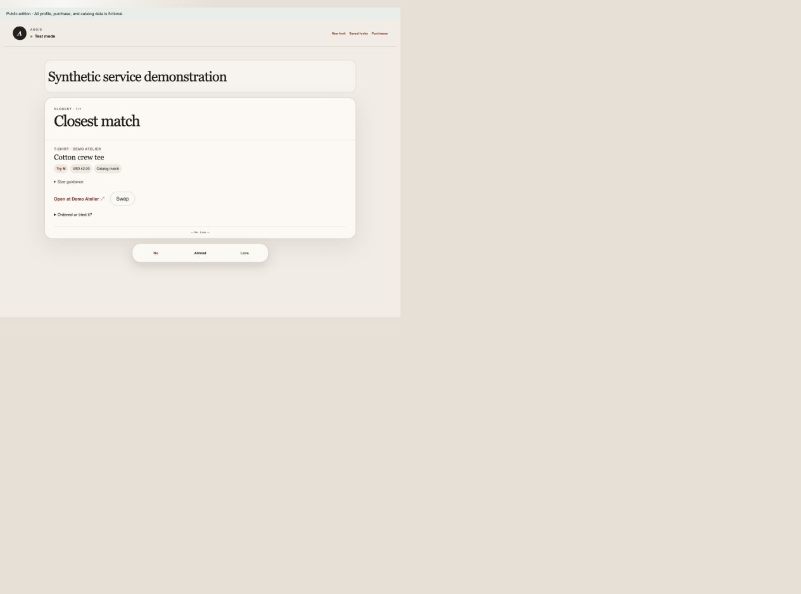

# Angie

A personal styling application that turns an inspiration or written request into product recommendations, then learns from confirmed reactions, tried sizes, and keep/return outcomes.

**Public edition:** the participant, measurements, purchase history, product catalog, and illustrations are fictional. The original recommendation and learning architecture remains. [Data boundary](docs/PUBLIC_DATA.md).



## Run without API keys

Requires Node.js 24 or newer.

```sh
npm ci --ignore-scripts
npm run demo
```

Open **http://127.0.0.1:4175**. Enter **`demo-participant`**. Try “White tee for a polished everyday outfit,” confirm a reaction, then inspect Saved looks or Purchases. **`demo-admin`** opens the demo administrator role.

External interpretation, visual scoring, discovery, and link verification use explicitly labeled synthetic adapters. The actual ranking, evidence gates, recommendation assembly, database persistence, feedback, and learning code still run. D1/R2 are emulated locally; no cloud account is connected. Products are fictional and cannot be purchased.

Demo mode defaults to an isolated test profile. Feedback persists in that local profile without changing the synthetic baseline. Local runtime data is ignored by Git.

## Architecture

| Layer | Source |
| --- | --- |
| Interface | [app/](app/), [components/](components/) |
| Shared pipeline | [lib/inspiration-pipeline.ts](lib/inspiration-pipeline.ts) |
| Production AI interpretation | [lib/inspiration-interpreter.ts](lib/inspiration-interpreter.ts) |
| Production visual matching | [lib/visual-matcher.ts](lib/visual-matcher.ts) |
| Search and merchant feeds | [lib/product-search.ts](lib/product-search.ts), [lib/merchant-feeds.ts](lib/merchant-feeds.ts) |
| Ranking and evidence | [lib/inspiration-engine.ts](lib/inspiration-engine.ts), [lib/garment-evidence.ts](lib/garment-evidence.ts) |
| Fit and learning | [lib/product-fit.ts](lib/product-fit.ts), [lib/inspiration-learning.ts](lib/inspiration-learning.ts) |
| Saved outcomes | [lib/saved-looks.ts](lib/saved-looks.ts), [outcome routes](app/api/inspiration/outcomes/route.ts) |
| Access separation | [lib/auth.ts](lib/auth.ts), [lib/inspiration-scope.ts](lib/inspiration-scope.ts) |
| Persistence | [db/](db/), [drizzle/](drizzle/), [lib/persistence.ts](lib/persistence.ts) |
| Demo boundary | [lib/demo-adapters.ts](lib/demo-adapters.ts), [synthetic data](data/) |

## Verify

```sh
npm run test:public
npx --no-install tsc --noEmit
npm run build
```

The offline regression checks cover evidence handling, ranking, source checks, role boundaries, isolation, feedback, saved looks, tried-size outcomes, retries, and migrations.

## Configure your own integrations

The real provider implementations remain in the source. Set `PUBLIC_DEMO=0` and configure your own service keys, access codes, and catalog before using live integrations. Demo access is only enabled in explicit public-demo mode; unconfigured normal access fails closed. No original site or account identifier is bundled.
