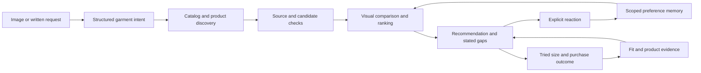

# Engineering guide: Angie

[Overview](../README.md) · [Run and inspect](REVIEW.md) · [Public data boundary](PUBLIC_DATA.md)

## The problem and the design

An inspiration image expresses appearance, proportions, garment construction, and styling. Shopping requires actual products, usable source evidence, appropriate sizes, and personal preferences. A plausible description of an outfit is insufficient to satisfy those constraints.

Angie breaks the task into interpretation, candidate retrieval, evidence checks, visual comparison, recommendation assembly, and a feedback loop. It keeps resemblance, taste, and physical fit distinct. The public edition retains this structure while replacing the participant and external service results with fictional examples.

## Follow one recommendation

1. **Accept a bounded request.** [The generation route](../app/api/inspiration/route.ts) authenticates the caller, validates text/image input, resolves the server-side session, and loads memory. It records the resulting recommendation, candidate audit, and generation context.
2. **Describe what is wanted.** [The interpreter](../lib/inspiration-interpreter.ts) produces structured garment intent. Its job is separate from product search; generated prose is not a catalog of purchasable items.
3. **Assemble a candidate pool.** [The shared pipeline](../lib/inspiration-pipeline.ts) combines [catalog retrieval](../lib/catalog-retrieval.ts), [merchant feeds](../lib/merchant-feeds.ts), and [product search](../lib/product-search.ts). Searches target individual missing garment slots so an abundance of trousers cannot conceal an absent top.
4. **Check and compare candidates.** The pipeline verifies candidate links and passes image evidence to [the visual matcher](../lib/visual-matcher.ts). [The engine](../lib/inspiration-engine.ts) applies ranking and garment constraints; [garment evidence](../lib/garment-evidence.ts) supports checks on the underlying construction.
5. **Recover or disclose gaps.** The pipeline can examine a disjoint second catalog page and run targeted recovery. [Search budgets](../lib/search-budget.ts) bound provider work. A partial result and an unfinished search are represented separately from a claim that no matching product exists.
6. **Persist before learning.** The app stores recommendations and candidate decisions. [Confirmed feedback](../app/api/inspiration/feedback/route.ts) creates scoped preference signals; [outcomes](../app/api/inspiration/outcomes/route.ts) record what was ordered, tried, kept, returned, or worn.

## Decisions and their costs

### Visual resemblance is not taste

A familiar brand or historically liked style should not erase the defining feature of a new inspiration. Retrieval and visual comparison preserve plausible matches before historical preferences influence the result. The engine contains explicit garment and construction checks rather than trusting a single aggregate score.

The cost is a larger pipeline, more diagnostics, and cases where no complete outfit passes. The offline suite includes cases where a high image score must not hide the wrong garment function, a major fit-shape mismatch, or an unrelated color combination.

### A shortlist miss is not an inventory miss

Only checking the first few retrieved items can produce a false “nothing available.” The pipeline records attempted candidates, tries a second disjoint page where appropriate, and searches missing or weak garment slots. Optional discovery failure can preserve already-qualified partial results.

This consumes more time and provider budget. Budget reservations and usage records constrain that cost, but the public demo cannot establish live search latency or cost: provider calls are simulated.

### Source checks constrain product claims

The live product-search path uses source citations and product-page checks. An invented URL in model prose must not become a recommendation. The regression suite distinguishes a working product page from a page shell, a wrong product, stale blocked evidence, or a known 404.

An accessible product page still does not prove that a selected size is currently in stock or will fit. The recommendation and fit layers retain that uncertainty. Synthetic demo links are fictional destinations and cannot be used to shop.

### A return is not automatically dislike, and a like is not proof of fit

[Learning](../lib/inspiration-learning.ts) uses targeted, explicitly confirmed reactions. Feedback about a hem should not teach a blanket dislike of a color or brand. Preferences are scoped to product or garment attributes and their effect is bounded.

[Fit guidance](../lib/product-fit.ts) distinguishes an exact item and tried size from historical same-style evidence, a related product, or a retailer size chart. Contradictory or weak evidence lowers confidence. New tried-size outcomes can update guidance on [saved looks](../lib/saved-looks.ts).

The cost is sparse learning: the system often has less evidence than a user expects. The current mechanism is structured memory and deterministic weighting, not training or fine-tuning a model. Persisting feedback is not proof that future recommendations improve.

### QA must not become personal learning

[Session scope](../lib/inspiration-scope.ts) is selected on the server. Only a live binding and participant role can select the personal session; client-supplied IDs cannot choose it. Administrators and test mode use the QA session. [Authentication](../lib/auth.ts) fails closed outside configured or explicit demo access.

The public Vite configuration forces test mode whenever the demo is enabled. The HTTP regression deliberately supplies an inherited live-mode setting, then verifies that demo feedback and tried sizes leave the personal baseline unchanged. The demo participant and demo administrator share a QA workspace; this is not a multi-tenant product.

## Persistence and inspectability

The [database schema](../db) and [migrations](../drizzle) retain sessions, recommendations, candidate audits, feedback, preference signals, and outcome events. Local development emulates D1 and R2. Recommendation records and audit events preserve the model/search identifiers, selected products, input context, and memory used during generation.

Confirmed feedback retries return the existing result rather than learning twice. Outcomes must reference an item actually shown in the stored recommendation. The public HTTP check exercises these paths against local D1, then reopens the saved result through the history route.

## What the public version can demonstrate

[Demo adapters](../lib/demo-adapters.ts) replace interpretation, visual scoring, search, retrieval, merchant feeds, and provider link verification. The original pipeline, engine, evidence rules, session scope, feedback, and persistence still execute. The demo is useful for inspecting those boundaries, not measuring the quality of a vision model or a shopping agent.

The original app, library, database, and migration paths from the supplied working project are retained. Personal measurements, purchase history, photos, product records, and deployment identity are replaced or excluded. Public illustrations are generated fictional garments.

The strongest next evaluation would use a consented, representative inspiration set with independently reviewed relevance, construction, source validity, and tried-fit outcomes across pipeline versions. That evaluation is not supplied or claimed by this repository. See [the review protocol](REVIEW.md) for the evidence that is available.
